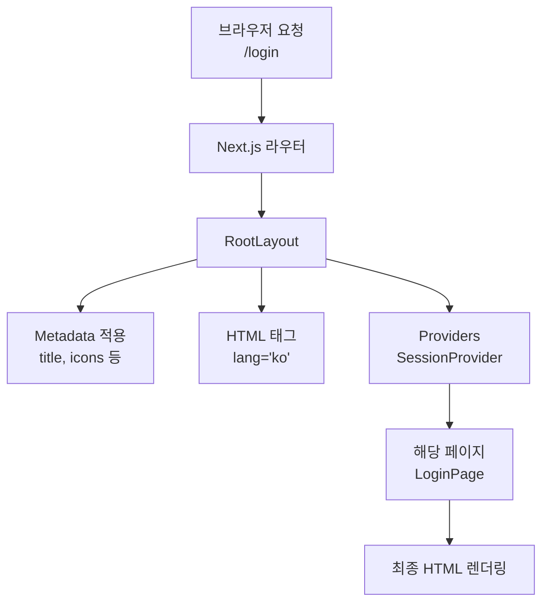

# 📚 Next.js 프로젝트 루트 레이아웃 - layout.tsx 완전 학습 가이드

## 🎯 이 파일이 하는 역할

`layout.tsx`는 **Next.js 애플리케이션의 가장 기본이 되는 틀**입니다. 마치 집의 기본 구조처럼, 이 파일에서 정의한 것이 모든 페이지에 공통으로 적용됩니다.

---

## 📖 코드 상세 분석

```tsx
// 1️⃣ TypeScript 타입 임포트
// Metadata는 Next.js에서 제공하는 타입으로, 페이지의 메타데이터(제목, 설명 등)를 정의할 때 사용합니다.
import type { Metadata } from "next";

// 2️⃣ Google Fonts 임포트
// Inter 폰트를 Google Fonts에서 가져와서 사이트 전체에 사용합니다.
// 파라미터 { subsets: ["latin"] }은 라틴 문자 subset만 로드하여 성능을 최적화합니다.
import { Inter } from "next/font/google";

// 3️⃣ 스타일 임포트
import "./globals.css";                                  // 전역 CSS 파일
import "bootstrap/dist/css/bootstrap.min.css";           // Bootstrap CSS 프레임워크 (반응형 디자인용)

// 4️⃣ 클라이언트 컴포넌트 임포트
// Providers는 NextAuth 세션과 같은 전역 상태를 모든 페이지에 제공하는 래퍼 컴포넌트입니다.
import Providers from "@/components/Providers";

// 5️⃣ Inter 폰트 설정
// 이렇게 설정한 폰트를 body 태그의 className에 추가하면 전역 폰트가 됩니다.
const inter = Inter({ subsets: ["latin"] });

// 6️⃣ 메타데이터 정의 (SEO와 브라우저 정보 제공)
// Metadata 객체는 HTML의 <head> 태그에 자동으로 추가됩니다.
export const metadata: Metadata = {
  // 브라우저 탭에 표시될 제목
  title: "회원정보 시스템",
  
  // Google 검색 결과에 표시될 설명
  description: "Vercel 기반 회원 관리 시스템",
  
  // Progressive Web App (PWA) 설정 파일 경로
  manifest: "/manifest.json",
  
  // 다양한 크기와 플랫폼용 아이콘 정의
  icons: {
    // 표준 Favicon (브라우저 탭 아이콘)
    icon: [
      { url: "/favicons/favicon-32x32.png", sizes: "32x32", type: "image/png" },
      { url: "/favicons/favicon-16x16.png", sizes: "16x16", type: "image/png" },
      { url: "/favicon.ico", type: "image/x-icon" },
    ],
    
    // Apple 기기용 아이콘 (iPhone, iPad에 북마크할 때 표시)
    apple: [
      { url: "/favicons/apple-icon-57x57.png", sizes: "57x57", type: "image/png" },
      { url: "/favicons/apple-icon-60x60.png", sizes: "60x60", type: "image/png" },
      { url: "/favicons/apple-icon-72x72.png", sizes: "72x72", type: "image/png" },
      { url: "/favicons/apple-icon-180x180.png", sizes: "180x180", type: "image/png" },
    ],
    
    // Android 기기용 아이콘
    other: [
      { url: "/favicons/android-icon-192x192.png", sizes: "192x192", type: "image/png" },
      { url: "/favicons/android-icon-512x512.png", sizes: "512x512", type: "image/png" },
    ],
  },
};

// 7️⃣ RootLayout 컴포넌트 (가장 중요한 부분!)
// 이것은 React 함수형 컴포넌트입니다. 
// RootLayout은 모든 다른 페이지를 감싸는 최상위 레이아웃입니다.
export default function RootLayout({
  // children: 각 페이지의 실제 내용이 여기에 들어갑니다.
  // 예: /login 페이지를 방문하면 <LoginPage /> 가 children으로 전달됩니다.
  children,
}: Readonly<{
  children: React.ReactNode;  // React 컴포넌트가 올 수 있는 모든 것을 받을 수 있음
}>) {
  return (
    // 8️⃣ HTML 루트 요소
    // lang="ko" 속성으로 한국어 페이지임을 명시합니다.
    <html lang="ko">
      {/* 9️⃣ BODY 태그 */}
      {/* className에 inter.className을 추가하여 Inter 폰트를 전체 사이트에 적용 */}
      <body className={inter.className}>
        
        {/* 🔟 Providers 컴포넌트로 감싸기 */}
        {/* Providers는 NextAuth의 SessionProvider를 래핑한 컴포넌트입니다.
            이를 통해 모든 자식 컴포넌트에서 세션 정보(로그인 정보)를 사용할 수 있습니다. */}
        <Providers>
          {/* 각 페이지의 실제 내용이 여기에 렌더링됩니다 */}
          {children}
        </Providers>
      </body>
    </html>
  );
}
```

---

## 🧠 핵심 개념 정리

### 📌 1. Metadata (메타데이터)
페이지에 대한 정보를 HTML의 `<head>` 태그에 설정합니다. 브라우저와 검색 엔진이 이 정보를 읽습니다.

| 속성 | 용도 | 예시 |
|------|------|------|
| `title` | 브라우저 탭 제목 | "회원정보 시스템" |
| `description` | Google 검색 결과 설명 | "Vercel 기반 회원 관리 시스템" |
| `manifest` | PWA 설정 파일 | "/manifest.json" |
| `icons` | 브라우저/모바일 아이콘 | 다양한 크기의 아이콘들 |

### 📌 2. Google Fonts 사용
```tsx
import { Inter } from "next/font/google";
const inter = Inter({ subsets: ["latin"] });
// <body className={inter.className}> 에 적용
```
- **Inter**: 깔끔한 산세리프 폰트
- **subsets: ["latin"]**: 라틴 문자만 로드하여 페이지 속도 향상

### 📌 3. Bootstrap CSS 프레임워크
```tsx
import "bootstrap/dist/css/bootstrap.min.css";
```
- 반응형 디자인(모바일, 태블릿, 데스크톱 지원)을 쉽게 만들 수 있음
- 버튼, 폼, 그리드 등 미리 만들어진 컴포넌트 제공

### 📌 4. Providers 패턴
```tsx
<Providers>
  {children}
</Providers>
```
- **래퍼 컴포넌트**: 모든 페이지를 이 컴포넌트로 감싸서 공통 기능 제공
- **세션 관리**: NextAuth의 SessionProvider를 통해 로그인 정보를 전 사이트에서 사용 가능

---

## 🔄 데이터 흐름도

```
요청 → 브라우저
  ↓
Next.js 라우터 (어느 페이지인지 결정)
  ↓
RootLayout (layout.tsx)
  ↓
Providers (세션 정보 제공)
  ↓
해당 페이지 컴포넌트 (예: page.tsx, login/page.tsx 등)
  ↓
렌더링된 HTML → 브라우저에 표시
```

---

## 💡 초보자가 꼭 알아야 할 점

### Q1: "layout.tsx에서 정의한 것이 모든 페이지에 적용된다"는 게 무슨 뜻?

**답변**: 예를 들어 로그인 페이지를 방문하면:

```
RootLayout이 먼저 렌더링됨
  ↓
<html lang="ko"> ... </html> 안에
  ↓
<body className={inter.className}> ... </body> 안에
  ↓
<Providers> ... </Providers> 안에
  ↓
LoginPage가 렌더링됨
```

따라서 로그인 페이지도 Inter 폰트와 Bootstrap CSS가 자동으로 적용됩니다!

### Q2: "Metadata"는 사용자에게 보이나요?

**답변**: 아니요! 메타데이터는 사용자에게 보이지 않습니다.

- ✅ 보임: 브라우저 탭의 제목 ("회원정보 시스템")
- ✅ 보임: 아이콘 (favicon - 탭 왼쪽 상단)
- ✅ 보임: 링크 공유 시 제목과 설명 (SNS에 공유할 때)
- ❌ 안 보임: HTML의 `<head>` 태그 안의 정보

### Q3: 왜 bootstrap을 import 할까요?

**답변**: Bootstrap은 미리 만들어진 CSS 모음입니다.

```tsx
import "bootstrap/dist/css/bootstrap.min.css";
```

이 한 줄 덕분에:
- `<button className="btn btn-primary">` 스타일이 자동 적용
- 반응형 그리드 `.row`, `.col` 사용 가능
- 모바일, 태블릿, PC 모두에서 자동으로 레이아웃 조정

---

## 🎨 다이어그램: 페이지 렌더링 구조



---

## 🚀 실습: 수정해보기

### 연습 1: 페이지 제목 바꿔보기
```tsx
// 변경 전
title: "회원정보 시스템",

// 변경 후 (직접 써보기)
title: "우리 모임 관리 시스템",
```

### 연습 2: 다른 폰트 사용해보기
```tsx
// Inter 대신 Roboto 사용
import { Roboto } from "next/font/google";
const roboto = Roboto({ weight: ['400', '700'], subsets: ["latin"] });

// body에 적용
<body className={roboto.className}>
```

---

## ✅ 최종 정리

| 항목 | 설명 |
|------|------|
| **목적** | 모든 페이지의 기본 HTML 구조 정의 |
| **metadata** | 페이지 제목, 설명, 아이콘 설정 (SEO) |
| **Inter 폰트** | 사이트 전체에 적용될 기본 폰트 |
| **Bootstrap** | 반응형 디자인 프레임워크 |
| **Providers** | 세션 정보 등을 모든 페이지에서 사용 가능하게 함 |

이 파일은 Next.js 프로젝트의 **기초 중의 기초**입니다. 모든 다른 파일을 이해하는 데 필요한 개념들이 여기 담겨 있습니다! 🎓
